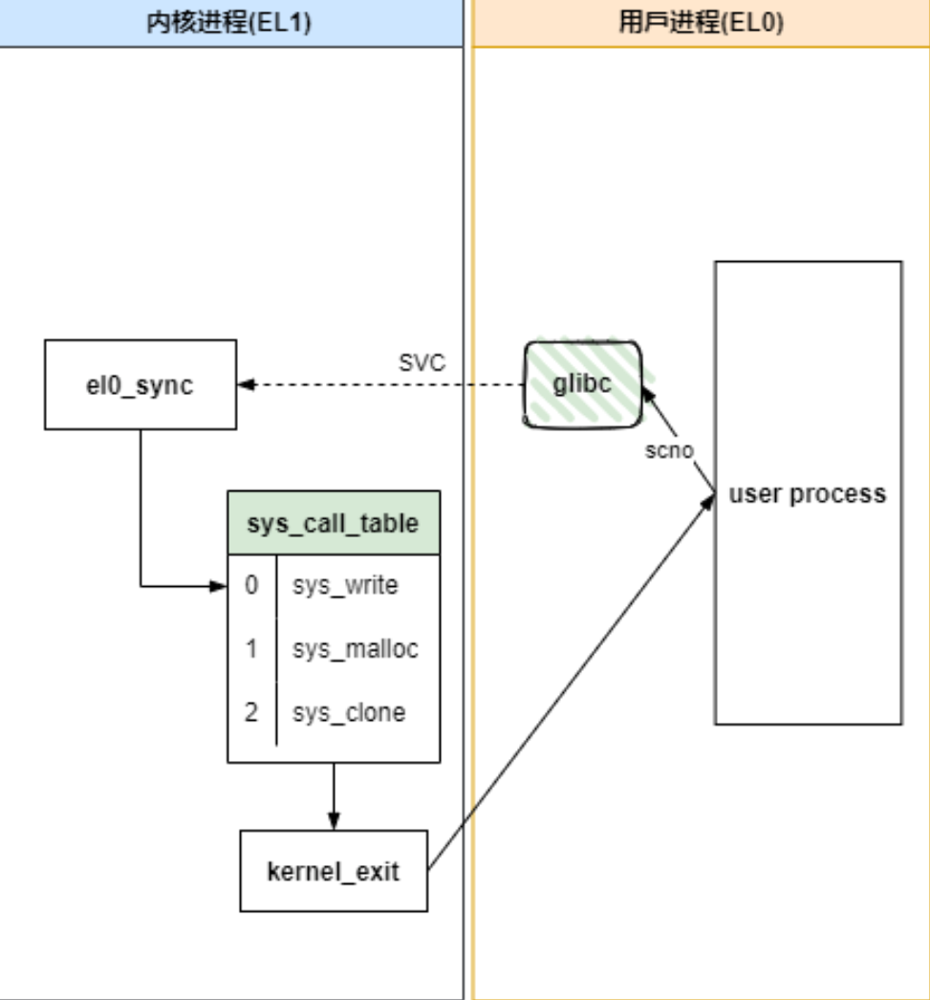
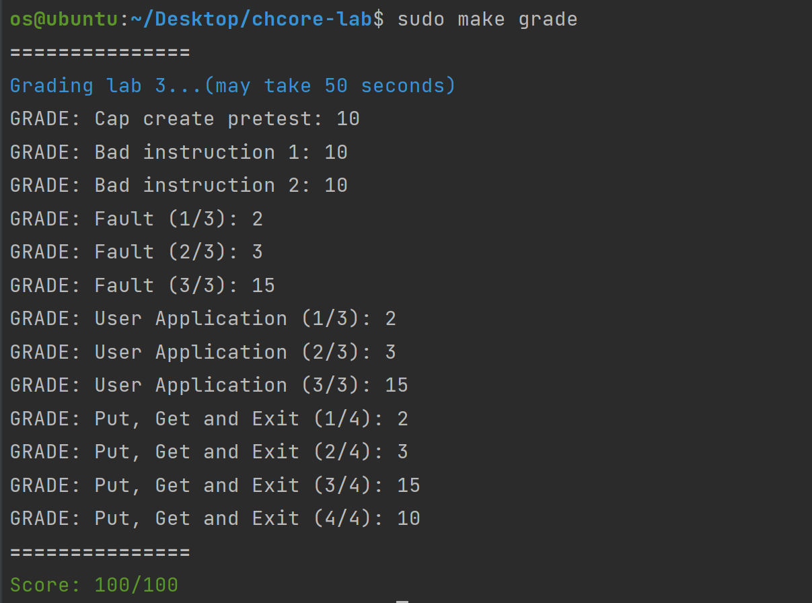

# Lab3

> 姓名：谈子铭
>
> 学号：520021910607

> 思考题 1: 内核从完成必要的初始化到用户态程序的过程是怎么样的？尝试描述一下调用关系。

```c++
// kernel/main.c
void main(paddr_t boot_flag)
{
        /* Init uart */
        uart_init();
        /* Init mm */
        mm_init();
        /* Init exception vector */
        arch_interrupt_init();
		/* create initial thread on smp_get_cpu_id() */
        create_root_thread();
        /* Context switch to the picked thread */
        eret_to_thread(switch_context());
}

// kernel/object/thread.c
void create_root_thread(void)
{
        struct cap_group *root_cap_group;
        int thread_cap;
        struct thread *root_thread;

        root_cap_group = create_root_cap_group(ROOT_NAME, strlen(ROOT_NAME));
        thread_cap = __create_root_thread(...);
    	...
        root_thread = obj_get(root_cap_group, thread_cap, TYPE_THREAD);
        /* Enqueue: put init thread into the ready queue */

        obj_put(root_thread);
        switch_to_thread(root_thread);
}
```

在 `main.c` 中，先调用 `arch_interrupt_init` 初始化异常向量表，然后调用 `create_root_thread`，它会先创建一个根进程，之后为进程创建一个主线程。具体而言即创建 `root_cap_group`，然后在这个group中创建 `root_thread`，并将 `current_thread` 切换为 `root_thread`，然后调用 `switch_context` 切换上下文，并找到 `root_thread` 的 thread control block 将其作为参数传给 `eret_to_thread`。`eret_to_thread` 用 `eret` 指令完成从内核模式到用户模式的切换，并在用户模式下开始运行用户代码。具体而言，它切换栈将 thread control block 的地址切换为新的栈指针，调用 `exception_exit` 恢复通用寄存器的值以及三个特殊寄存器（`sp_el0`,`elr_el0`, `spsr_el1`）的值并最终调用 `eret` 返回。

> 练习题 2: 在 `kernel/object/cap_group.c` 中完善 `cap_group_init`、`sys_create_cap_group`、`create_root_cap_group` 函数。在完成填写之后，你可以通过 Cap create pretest 测试点。**注意通过这里的测试并不代表完全实现正确，后续在实验 4 中会再次测试这一部分。**

> 练习题 3: 在 `kernel/object/thread.c` 中完成 `load_binary` 函数，将用户程序 ELF 加载到刚刚创建的进程地址空间中。

> 练习题 4: 按照前文所述的表格填写 `kernel/arch/aarch64/irq/irq_entry.S` 中的异常向量表，并且增加对应的函数跳转操作。

代码使用到的相关 ARM 汇编指令：

```assembly
# stp 入栈指令（str 的变种指令，可以同时操作两个寄存器）
stp x29, x30, [sp, #0x10]	# 将 x29, x30 的值存入 sp 偏移 16 个字节的位置
# ldp 出栈指令（ldr 的变种指令，可以同时操作两个寄存器）
ldp x29, x30, [sp, #0x10]   # 将 sp 偏移 16 个字节的值取出来，存入寄存器 x29 和寄存器 x30
```

> 练习题 5: 填写 `kernel/arch/aarch64/irq/pgfault.c` 中的 `do_page_fault`，需要将缺页异常转发给 `handle_trans_fault` 函数。

> 练习题 6: 填写 `kernel/mm/pgfault_handler.c` 中的 `handle_trans_fault`，实现 `PMO_SHM` 和 `PMO_ANONYM` 的按需物理页分配。

> 练习题 7: 按照前文所述的表格填写 `kernel/arch/aarch64/irq/irq_entry.S` 中的 `exception_enter` 与 `exception_exit`，实现上下文保存的功能。如果正确完成这一部分，可以通过Bad Instruction 1、Bad Instruction 2、Fault测试点，并可以在运行 `badinst1.bin`、`badinst2.bin` 时正确输出如下结果：
>
> ```
> [INFO] Exception type: 8
> ```

> 思考题 8： ChCore中的系统调用是通过使用汇编代码直接跳转到`syscall_table`中的
> 相应条目来处理的。请阅读`kernel/arch/aarch64/irq/irq_entry.S`中的代码，并简要描述ChCore是如何将系统调用从异常向量分派到系统调用表中对应条目的。

在 `kernel/arch/aarch64/irq/irq_entry.S` 文件中定义了异常向量表：

```assembly
.macro  exception_entry    label
   /* Each entry should be 0x80 aligned */
   .align 7   /* align to 2^7 = 0x80 */
   b  \label
.endm

.align 11  /* align to 2^11 = 0x800 */
EXPORT(el1_vector)
	...
   	exception_entry sync_el1h
   	exception_entry irq_el1h
   	exception_entry fiq_el1h
   	exception_entry error_el1h
   	...
```

`svc` 系统调用会触发一个同步异常，异常来源是 `EL0`，所以处理入口是 `sync_el0_64 (Synchronous 64-bit EL0)`，即跳转到 `sync_el0_64` 对应 label。

```assembly
sync_el0_64:
   /* Since we cannot touch x0-x7, we need some extra work here */
   exception_enter
   mrs    x25, esr_el1
   lsr    x24, x25, #ESR_EL1_EC_SHIFT
   cmp    x24, #ESR_EL1_EC_SVC_64
   b.eq   el0_syscall
   /* Not supported exception */
   ......
```

该函数中首先通过 `exception_enter` 宏在栈上保存通用目的寄存器后，然后读取 `esr_el1` 寄存器的值到 `x25` 后右移 `ESR_EL1_EC_SHIFT` 位赋值给 `x24`，`x24` 里面的值就是 `EC`，判断 `EC` 值是否等于 `ESR_EL1_EC_SVC_64`，如果等于则说明该同步异常是由 `svc` 指令触发的，则跳转到 `el0_syscall` 来响应 `svc`。

```assembly
el0_syscall:
	sub	sp, sp, #16 * 8
	stp	x0, x1, [sp, #16 * 0]
	......
	stp	x14, x15, [sp, #16 * 7]
	
	ldp	x0, x1, [sp, #16 * 0]
	......
	ldp	x14, x15, [sp, #16 * 7]
	add	sp, sp, #16 * 8

	adr	x27, syscall_table		// syscall table in x27
	uxtw	x16, w8				// syscall number in x16
	ldr	x16, [x27, x16, lsl #3]		// find the syscall entry
	blr	x16	// call sys_* routine

	/* Ret from syscall */
	str	x0, [sp]
	exception_exit
```

`el0_syscall` 将系统调用数组首地址 `syscall_table` 加载到 `x27`，用户空间传递下来的系统调用号加载到 `x16`，并通过 `ldr	x16, [x27, x16, lsl #3]` 计算找到对应的系统调用条目，之后通过 `blr x16` 调用相应系统调用。系统调用逻辑结束后将系统调用返回值从 `[sp]` 加载到 `x0` 寄存器，然后调用  `exception_exit` 恢复通用目的寄存器，恢复到同步异常发生前的现场。至此整个系统调用流程结束。



> 练习题 9: 填写 `kernel/syscall/syscall.c` 中的 `sys_putc`、`sys_getc`，`kernel/object/thread.c` 中的 `sys_thread_exit`，`libchcore/include/chcore/internal/raw_syscall.h` 中的 `__chcore_sys_putc`、`__chcore_sys_getc`、`__chcore_sys_thread_exit`，以实现 `putc`、`getc`、`thread_exit` 三个系统调用。

> 挑战题 10: 截止到现在由于没有磁盘，因此我们采用一部分内存模拟磁盘。内存页是可以换入换出的，请设计一套换页策略（如 LRU 等），并在 `kernel/mm/pgfault_handler.c` 中的 `handle_trans_fault` 实现你的换页方法。

