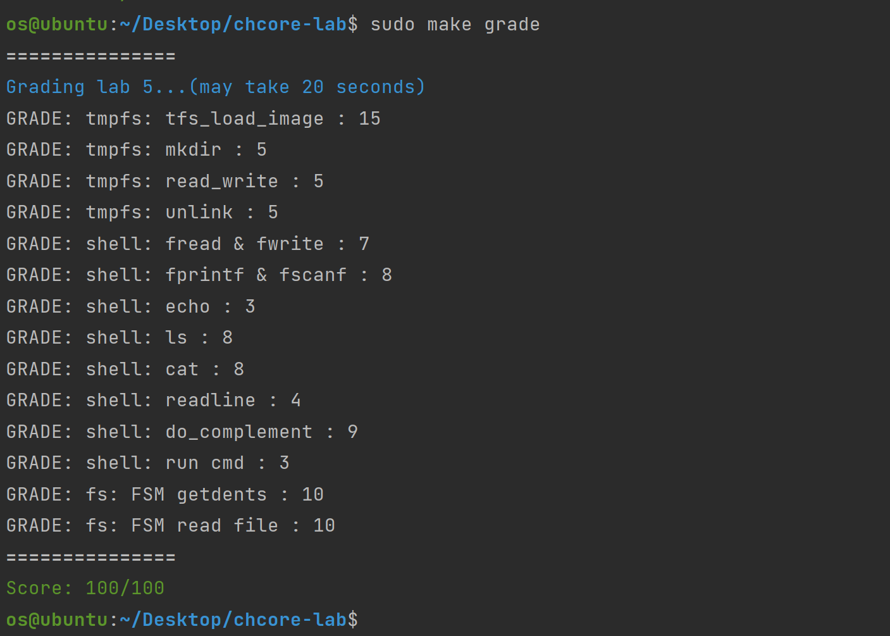

# Lab5

> 姓名：谈子铭
>
> 学号：520021910607

> 思考题 1: 文件的数据块使用基数树的形式组织有什么好处? 除此之外还有其他的数据块存储方式吗?

基数树是一种用于进行空间存储优化的数据结构。文件的数据块的标识是各个内存页的顺序编号，它们有很长相同前缀，使用基数树的形式组织能够节省很多空间。同时相比于字典树，基数树最大的区别点在于它不是按照每个字符长度作为节点进行拆分，而是将一个或多个字符元素作为一个分支（边）来存储数据，这可以避免长字符出现很深的节点。这使得基数树更适用于对于较小的集合（尤其是字符串很长的情况下）和有很长相同前缀的字符串集合。当文件数据块很少且其内存页的顺序编号有公共前缀时（很常见，因为文件内数据存储连续中间无空洞，顺序编号也就连续，也即存储数据的页编号大部分前缀相同）可以减少树深，同时进一步减少空间占用。

还可以使用hash表，或字典树等。

> 练习题 4：实现位于`userland/servers/tmpfs/tmpfs.c`的`tfs_load_image`函数。需要通过之前实现的tmpfs函数进行目录和文件的创建，以及数据的读写。

- `tfs_load_image`：遍历 `cpio` 文件，先调用 `tfs_namex` 找到其父目录和文件名，之后调用`tfs_lookup` 判断改文件是否存在，如果不存在，则根据文件类型调用 `tfs_creat` 或者 `tfs_mkdir` 新建，之后将数据写入。

> 练习题 6：补全`libchcore/src/libc/fs.c`与`libchcore/include/libc/FILE.h`文件，以实现`fopen`, `fwrite`, `fread`, `fclose`, `fscanf`, `fprintf`五个函数，函数用法应与libc中一致。

- 注意 `fopen` 时如果文件不存在，需要创建对应文件
- 注意 `WRITE` 请求需要将写入的内容附在 `fs_request` 的后面（不像其它 IPC 请求所有的传递内容都在 `fs_request` 结构体中定义好了）；因此在创建对应消息时需要注意分配对应的空间

> 练习题 8：根据在`userland/servers/shell/shell.c`中实现好的`bultin_cmd`函数，完成shell中内置命令对应的`do_*`函数，需要支持的命令包括：`ls [dir]`、`echo [string]`、`cat [filename]`和`top`。

- `ls [dir]` 注意要略过 `.` 项

> 练习题 9：实现在`userland/servers/shell/shell.c`中定义的`run_cmd`，以通过输入文件名来运行可执行文件，同时补全`do_complement`函数并修改`readline`函数，以支持按tab键自动补全根目录（`/`）下的文件名。

- `do_complement`：`open` 根目录拿到 `fd`，然后根据 `complement_time` 反复调用 `get_dent_name`，遍历目录项的 `name`，等到对应序号的 `name` 将其打印即可（注意要略过 `.` 项）

> 练习题 10：FSM需要两种不同的文件系统才能体现其特点，本实验提供了一个fakefs用于模拟部分文件系统的接口，测试代码会默认将tmpfs挂载到路径`/`，并将fakefs挂载在到路径`/fakefs`。本练习需要实现`userland/server/fsm/main.c`中空缺的部分，使得用户程序将文件系统请求发送给FSM后，FSM根据访问路径向对应文件系统发起请求，并将结果返回给用户程序。实现过程中可以使用`userland/server/fsm`目录下已经实现的函数。

在 `fsm_server_disptach` 中补全转发 IPC 请求的逻辑即可。注意这是两个 IPC 不能复用，需要重新构造 IPC 请求，拷贝参数并发送给对应的文件系统。

## 测试结果



## va_list、va_arg、va_start 和 va_end 宏的学习

在 `stdarg.h` 中被定义成宏

```c
typedef char *va_list;
```


**va_start宏**，获取可变参数列表的第一个参数的地址（list是类型为va_list的指针，param1是可变参数最左边的参数）：

```c
#define va_start(list,param1)   ( list = (va_list)&param1+ sizeof(param1) )
```

**va_arg宏**，获取可变参数的当前参数，返回指定类型并将指针指向下一参数（[mode参数](https://www.zhihu.com/search?q=mode参数&search_source=Entity&hybrid_search_source=Entity&hybrid_search_extra={"sourceType"%3A"article"%2C"sourceId"%3A"291148403"})描述了当前参数的类型）：

```c
#define va_arg(list,mode)   ( (mode *) ( list += sizeof(mode) ) )[-1]
```

**va_end宏**，清空va_list可变参数列表：

```text
#define va_end(list) ( list = (va_list)0 )
```

 注：以上 `sizeof()` 只是为了说明工作原理，实际实现中，增加的字节数需保证为为int的整数倍

```c
#define _INTSIZEOF(n) ( (sizeof(n) + sizeof(int) - 1) & ~(sizeof(int) - 1) )
```

### 原理

C语言中函数参数的内存布局。函数参数是存储在栈中，函数参数从右往左依次入栈。相当于直接去栈上拿参数。

最复杂的宏是va_arg。它必须返回一个由va_list所指向的恰当的类型的数值，同时递增va_list，使它指向参数列表中的一个参数(即递增的大小等于与va_arg宏所返回的数值具有相同类型的对象的长度)。因为类型转换的结果不能作为赋值运算的目标，所以va_arg宏首先使用sizeof来确定需要递增的大小，然后把它直接加到va_list上，这样得到的指针再被转换为要求的类型。因为该指针现在指向的位置"过"了一个类型单位的大小，所以我们使用了下标-1来存取正确的返回参数。

### 使用

`va_list` 是一个字符指针，可以理解为指向当前参数的一个指针，取参必须通过这个指针进行。

1. 在调用参数表之前，定义一个 `va_list` 类型的变量，(假设 `va_list` 类型变量被定义为 `ap`)

2. 对 `ap` 进行初始化，让它指向可变参数表里面的第一个参数，这是通过 `va_start` 来实现的，第一个参数是 `ap` 本身，第二个参数是在变参表前面紧挨着的一个变量，即 “...” 之前的那个参数

3. 获取参数，调用 `va_arg`，它的第一个参数是 `ap`，第二个参数是要获取的参数的指定类型，然后返回这个指定类型的值，并且把 `ap` 的位置指向变参表的下一个变量位置

4. 获取所有的参数之后，我们有必要将这个 `ap` 指针关掉，方法是调用 `va_end`，将输入的参数 `ap` 置为 NULL，应该养成获取完参数表之后关闭指针的习惯

例如 `int max(int n, ...);` 其函数内部应该如此实现：

```c
int max(int n, ...) {	// 定参 n 表示后面变参数量
	va_list ap;	// 定义一个 va_list 指针来访问参数表
    va_start(ap, n);	// 初始化 ap，让它指向第一个变参，n之后的参数
    int maximum = -0x7FFFFFFF;	// 这是一个最小的整数
    int temp;
    for(int i = 0; i < n; i++) {
    	temp = va_arg(ap, int);	// 获取一个 int 型参数，并且 ap 指向下一个参数
    	if(maximum < temp) maximum = temp;
    }
    va_end(ap);	// 善后工作，关闭 ap
    return max;
}
```
